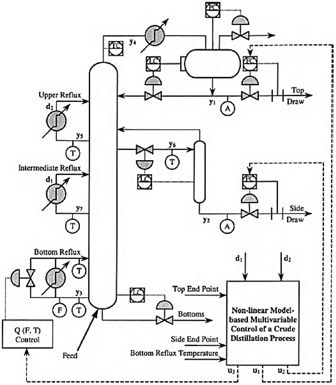

# Shell Standard Control Problem



The Shell Standard Control Problem is a well-known benchmark problem that involves controlling a heavy oil fractionator (distillation column) using a linear MIMO (Multi-Input Multi-Output) system model. The problem was first presented by Shell Oil Company and has become a standard test case for evaluating advanced process control strategies.

### Process Description

A **fractionator** (or distillation column) is a vertical cylindrical vessel used in petroleum refineries to separate crude oil into different products based on boiling points. In this specific case, the fractionator processes heavy crude oil to separate it into:

- **Top products**: Light components (LPG, Gasoline)
- **Middle products**: Intermediate components (Diesel, Kerosene) 
- **Bottom products**: Heavy residuals (Bunker Fuel, Asphalt)

### System Complexity

The heavy oil fractionator exhibits:

- **3 control inputs (manipulated variables)**, **2 measured disturbances**, and **7 measured outputs**
- Significant transport lags (0-28 seconds) between inputs and outputs
- First-order responses with widely varying time constants (2-60 seconds)
- Changes in one input affect multiple outputs (strong coupling)
- Gain and time constant values vary with operating conditions

## System Inputs

The system has 3 controlled inputs and 2 measured disturbance inputs:

**u1** - **Top Draw**: Controls the withdrawal rate of light products from the top of the column
**u2** - **Side Draw**: Controls the withdrawal rate of intermediate products from the side of the column
**u3** - **Bottoms Reflux Duty**: Controls the heat input (reboiler duty) at the bottom of the column
**d1** - **Upper Reflux Duty**: Upper reflux flow measured disturbance
**d2** - **Intermediate Reflux Duty**: Intermediate reflux flow measured disturbance

## System Outputs

The system has 7 outputs measuring temperature:

**v1** - **Top End Point**: Temperature/composition of top product
**v2** - **Side End Point**: Temperature/composition of side product
**v3** - **Top Temperature**: Temperature in the top section of the column 
**v4** - **Upper Reflux Temperature**: Temperature of upper reflux stream
**v5** - **Side Draw Temperature**: Temperature at the side draw point
**v6** - **Intermediate Reflux Temperature**: Temperature of intermediate reflux 
**v7** - **Bottoms Reflux Temperature**: Temperature of bottom product/reboiler outlet

## Transfer Function

The system is represented as a **7×5 linear transfer function matrix**, where each element describes the relationship between one input and one measured output:

$$G(s) = \begin{bmatrix}
G_{11}(s) & G_{12}(s) & G_{13}(s) & G_{14}(s) & G_{15}(s) \\
G_{21}(s) & G_{22}(s) & G_{23}(s) & G_{24}(s) & G_{25}(s) \\
\vdots & \vdots & \vdots & \vdots & \vdots \\
G_{71}(s) & G_{72}(s) & G_{73}(s) & G_{74}(s) & G_{75}(s)
\end{bmatrix}$$

Where columns 1-3 represent the transfer functions from control inputs (u1, u2, u3) and columns 4-5 represent the transfer functions from measured disturbances (d1, d2).

Each element $G_{ij}(s)$ (from input $j$ to output $i$) has the form:

$$G_{ij}(s) = \frac{K_{ij} \cdot e^{-\tau_{ij}s}}{T_{ij}s + 1}$$

Where:
- **$K_{ij}$**: Steady-state gain
- **$e^{-\tau_{ij}s}$**: Time delay (dead time)
- **$T_{ij}s + 1$**: First-order pole - represents exponential approach to steady state

The steady-state gain matrix is:

```
     Input1  Input2  Input3  Input4  Input5
Out1: 4.05    1.77    5.88    1.2     1.44
Out2: 5.39    5.72    6.9     1.52    1.83
Out3: 3.66    1.65    5.53    1.16    1.27
Out4: 5.92    2.54    8.1     1.73    1.79
Out5: 4.13    2.38    6.23    1.31    1.26
Out6: 4.06    4.18    6.53    1.19    1.17
Out7: 4.38    4.42    7.20    1.14    1.26
```

The time constants representing the speed of response:

```
     Input1  Input2  Input3  Input4  Input5
Out1: 50      60      50      45      40
Out2: 50      60      40      25      20
Out3: 9       30      40      11      6
Out4: 12      27      20      5       19
Out5: 8       19      10      2       22
Out6: 13      33      9       19      24
Out7: 33      44      19      27      32
```

The transport delays before any response is observed:

```
     Input1  Input2  Input3  Input4  Input5
Out1: 27      28      27      27      27
Out2: 18      14      15      15      15
Out3: 2       20      2       0       0
Out4: 11      12      2       0       0
Out5: 5       7       2       0       0
Out6: 8       4       1       0       0
Out7: 20      22      0       0       0
```
